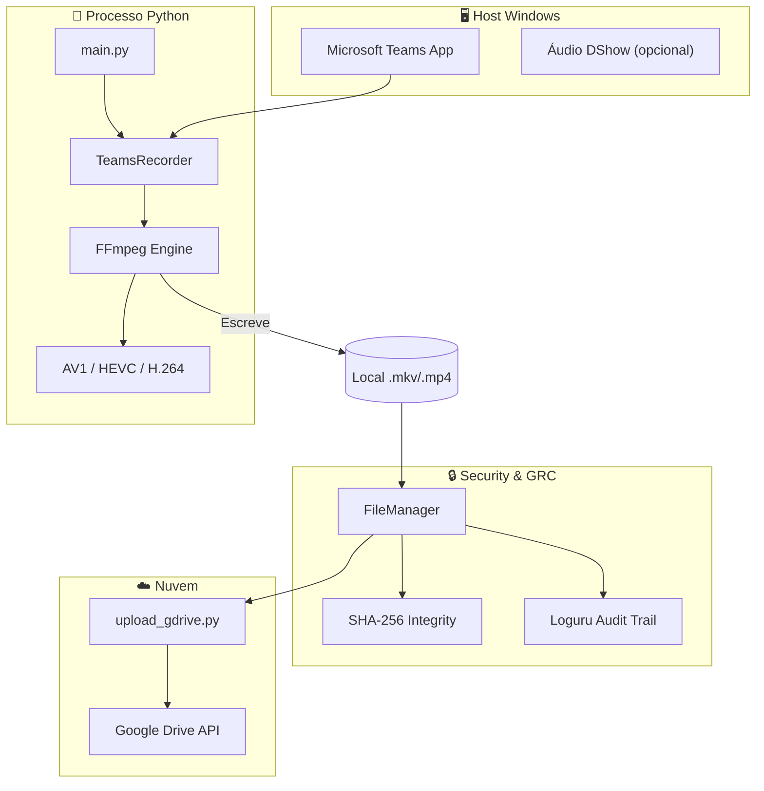

# 📚 Documentação — Gravador de Aula Teams FIAP

<p align="center">
  
</p>

<p align="center">
  <a href="https://github.com/carmipa/gravador_de_aula/actions/workflows/tests.yml"></a>
  
  <a href="https://www.python.org/"></a>
  <a href="https://github.com/astral-sh/ruff"></a>
  <a href="https://www.microsoft.com/windows"></a>
  <a href="../LICENSE"></a>
</p>

> Documentação técnica completa: arquitetura, configuração, fluxos, GRC e desenvolvimento.  
> **README principal do projeto:** [../README.md](../README.md)

---

## 🏗️ Diagrama de arquitetura (Mermaid)

O GitHub renderiza nativamente diagramas Mermaid. Visão por contexto: **Host Windows** → **Processo Python** → **Segurança/GRC** → **Nuvem**.



Mais diagramas (sequência, classes, deployment): **[Arquitetura (detalhes)](architecture.md)**.

---

## 📂 Estrutura do projeto (navegação)

| Ícone | Caminho | Descrição |
|-------|---------|-----------|
| 📂 | Raiz do repositório | Código fonte principal. |
| 📄 | **main.py** | 🟢 Ponto de entrada; tratamento de sinais (SIGINT/SIGTERM); orquestração. |
| 📄 | **gravador.py** | 🎥 Orquestração FFmpeg, captura de janela (pygetwindow), leak prevention. |
| 📄 | **file_manager.py** | 🛡️ Verificação de integridade (SHA-256/MD5), gestão de arquivos, cópia Drive. |
| 📄 | **upload_gdrive.py** | ☁️ OAuth, upload via API, verificação pós-upload, credential scrubbing. |
| 📄 | **logger_config.py** | 📝 Configuração Rich (terminal) + Loguru (auditoria em arquivo). |
| 📄 | **config.py** | ⚙️ Variáveis de ambiente (.env), constantes do projeto. |
| 📂 | **tests/** | 🧪 Suíte de testes (pytest); mocks e unitários. |
| 📂 | **logs/** | 📜 Logs de auditoria (Audit Trail); rotação e retenção. |
| 📂 | **doc/** | 📚 Esta documentação (arquitetura, fluxos, GRC, desenvolvimento). |
| 📂 | **.github/workflows/** | 🔄 CI/CD (testes, Ruff, cobertura mínima 85%). |

---

## 🔀 Guia de funcionamento (fluxo relevante para GRC)

Para que ferramentas (Cursor, LLMs, revisores) entendam o comportamento do programa:

1. **Interceptação** — O bot localiza o **HWND** da janela do Teams via `pygetwindow.getAllWindows()` e filtro por título (`TEAMS_WINDOW_TITLE`).
2. **Captura segura** — O FFmpeg é iniciado via **subprocess** com **stdin mapeado** (`PIPE`). O encerramento envia `q` ao stdin (não `kill`), garantindo que o container seja fechado e o arquivo não fique corrompido.
3. **Auditoria em tempo real** — Cada evento (início, janela em foco, modo screen-share, erro) é registrado com ícones e cores no terminal (Rich) e espelhado em log de auditoria em `logs/audit_YYYY-MM-DD.log`.
4. **Verificação de custódia** — Ao finalizar, o `FileManager` gera o **hash SHA-256** do arquivo. Se houver upload para o Drive, o bot re-baixa os metadados do arquivo no Drive e compara o hash. Se divergir, é disparado alerta de **Integridade violada**.

Detalhes: [Fluxos](flows.md) e [GRC e Segurança](grc-security.md).

---

## 🎨 Cores e estética no terminal (Rich)

Interpretação das cores nos logs do terminal:

| Cor | Uso no projeto |
|-----|-----------------|
| 🟦 **Azul** | Informações de sistema (prefixo FIAP-BOT, mensagens informativas). |
| 🟨 **Amarelo** | Alertas: leak prevention (janela fora de foco), verificação de hash falhou, interrupção. |
| 🟩 **Verde** | Sucesso em operações (arquivo salvo, upload concluído, I/O OK). |
| 🟥 **Vermelho** | Falhas críticas que exigem intervenção (FFmpeg não encontrado, falha ao iniciar gravação, exceção não tratada). |

Configuração: `logger_config.py` (RichHandler + formato `[bold blue]FIAP-BOT[/] | {message}`).

---

## 📑 Índice da documentação

| Ícone | Documento | Conteúdo |
|-------|-----------|----------|
| 🏗️ | [**Arquitetura**](architecture.md) | Diagramas de componentes, sequência, classes e deployment (Mermaid). |
| ⚙️ | [**Configuração**](configuration.md) | Todas as variáveis de ambiente, defaults e opções avançadas. |
| 🔀 | [**Fluxos**](flows.md) | Fluxo de gravação, health check, encerramento gracioso e upload em background. |
| 🔒 | [**GRC e Segurança**](grc-security.md) | Leak prevention, credential scrubbing, integridade (SHA-256/MD5), auditoria. |
| 🧪 | [**Desenvolvimento**](development.md) | Testes (pytest), CI/CD (GitHub Actions), lint (Ruff), cobertura. |
| 📐 | [**Diagramas**](diagrams/README.md) | Referência de todos os diagramas Mermaid. |

---

## 🎯 Visão geral do projeto

```
┌─────────────────────────────────────────────────────────────────┐
│  Gravador de Aula — Teams FIAP                                   │
│  Grava a janela do Microsoft Teams (gdigrab + FFmpeg)            │
│  com codecs AV1/HEVC/H.264 e opcional upload para Google Drive.  │
└─────────────────────────────────────────────────────────────────┘
```

- **Entrada:** janela do Teams (título configurável), opcional áudio DShow.
- **Saída:** arquivo de vídeo em `gravacoes/` (ou `GRAVACOES_DIR`), opcional cópia/upload para Drive.
- **Controles:** Health check (arquivo crescendo), encerramento gracioso (`q` no FFmpeg), upload em thread.

Para **instalação e uso rápido**, use o [README na raiz](../README.md).
