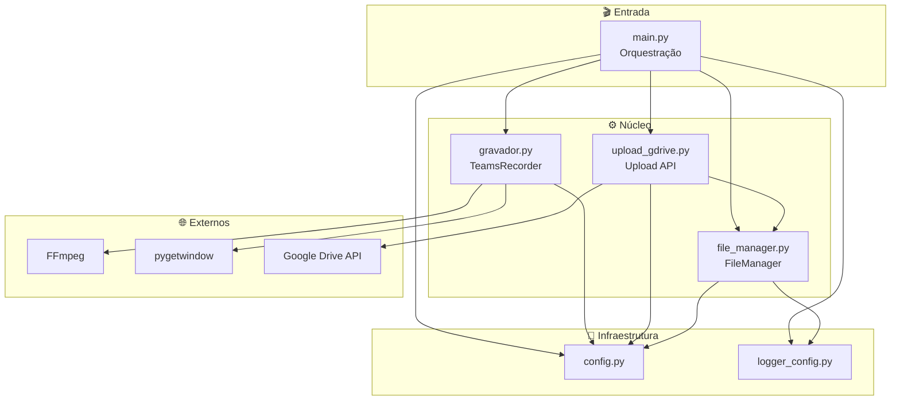

# 📚 Documentação — Gravador de Aula Teams FIAP

<p align="center">
  
</p>

<p align="center">
  <a href="https://github.com/carmipa/gravador_de_aula/actions/workflows/tests.yml">
    
  </a>
  <a href="https://www.python.org/">
    
  </a>
  <a href="https://www.microsoft.com/windows">
    
  </a>
  <a href="../LICENSE">
    
  </a>
</p>

> Documentação técnica completa: arquitetura, configuração, fluxos, GRC e desenvolvimento.  
> **README principal do projeto:** [../README.md](../README.md)

---

## 🏗️ Diagrama de arquitetura

Visão dos módulos e dependências (o GitHub renderiza o Mermaid abaixo automaticamente):



Mais diagramas (sequência, classes, deployment): **[Arquitetura (detalhes)](architecture.md)**.

---

## 📑 Índice da documentação

| Ícone | Documento | Conteúdo |
|-------|-----------|----------|
| 🏗️ | [**Arquitetura**](architecture.md) | Diagramas de componentes, sequência, classes e deployment (Mermaid). |
| ⚙️ | [**Configuração**](configuration.md) | Todas as variáveis de ambiente, defaults e opções avançadas. |
| 🔀 | [**Fluxos**](flows.md) | Fluxo de gravação, health check, encerramento gracioso e upload em background. |
| 🔒 | [**GRC e Segurança**](grc-security.md) | Leak prevention, credential scrubbing, integridade (SHA-256/MD5), auditoria. |
| 🧪 | [**Desenvolvimento**](development.md) | Testes (pytest), CI/CD (GitHub Actions), lint (Ruff), cobertura. |
| 📐 | [**Diagramas**](diagrams/README.md) | Referência de todos os diagramas Mermaid. |

---

## 🎯 Visão geral do projeto

```
┌─────────────────────────────────────────────────────────────────┐
│  Gravador de Aula — Teams FIAP                                   │
│  Grava a janela do Microsoft Teams (gdigrab + FFmpeg)            │
│  com codecs AV1/HEVC/H.264 e opcional upload para Google Drive.  │
└─────────────────────────────────────────────────────────────────┘
```

- **Entrada:** janela do Teams (título configurável), opcional áudio DShow.
- **Saída:** arquivo de vídeo em `gravacoes/` (ou `GRAVACOES_DIR`), opcional cópia/upload para Drive.
- **Controles:** Health check (arquivo crescendo), encerramento gracioso (`q` no FFmpeg), upload em thread.

Para **instalação e uso rápido**, use o [README na raiz](../README.md).
