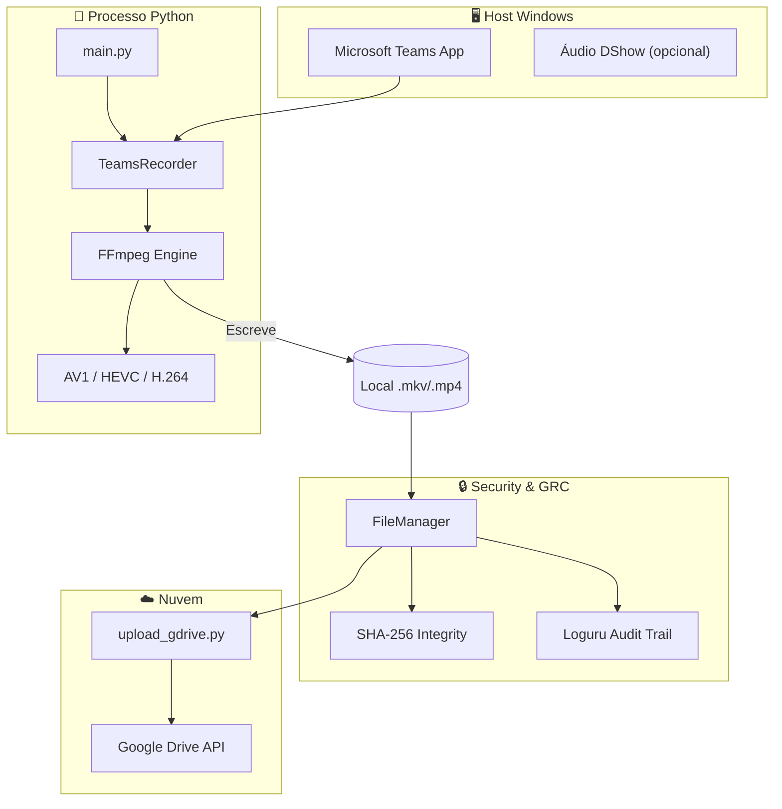
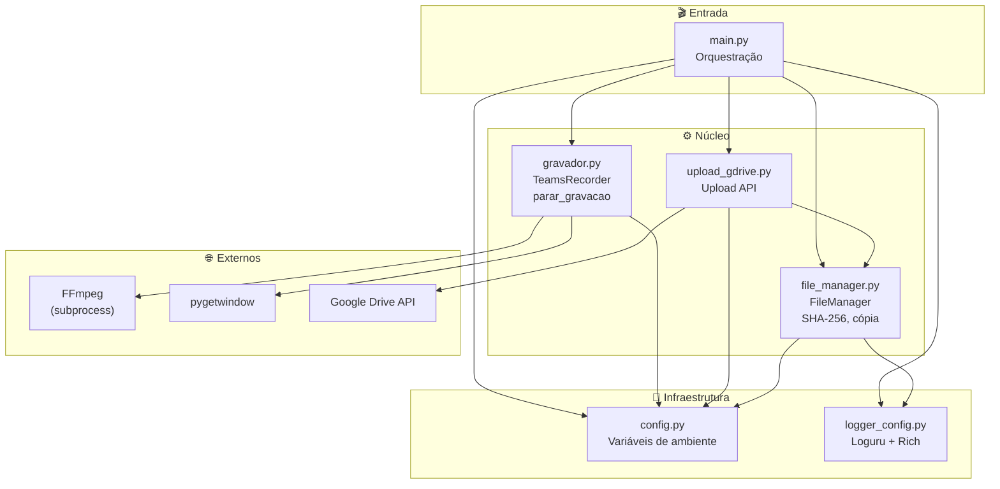
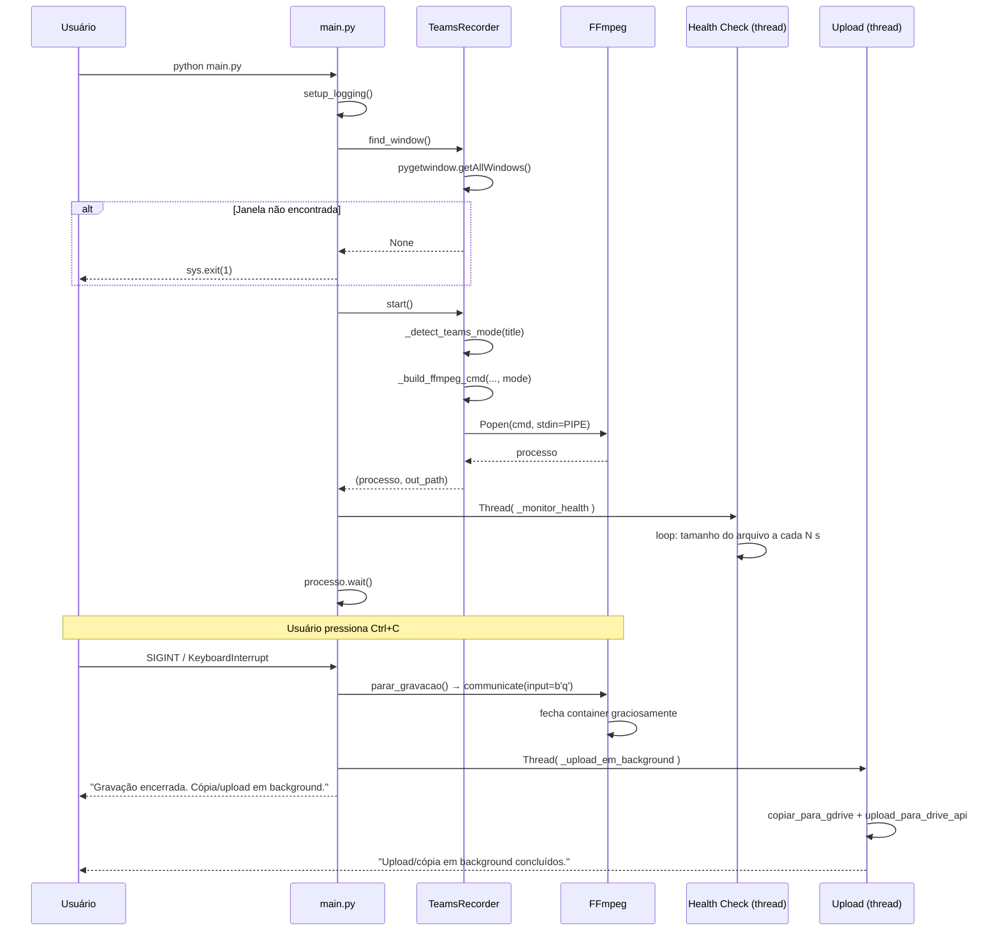
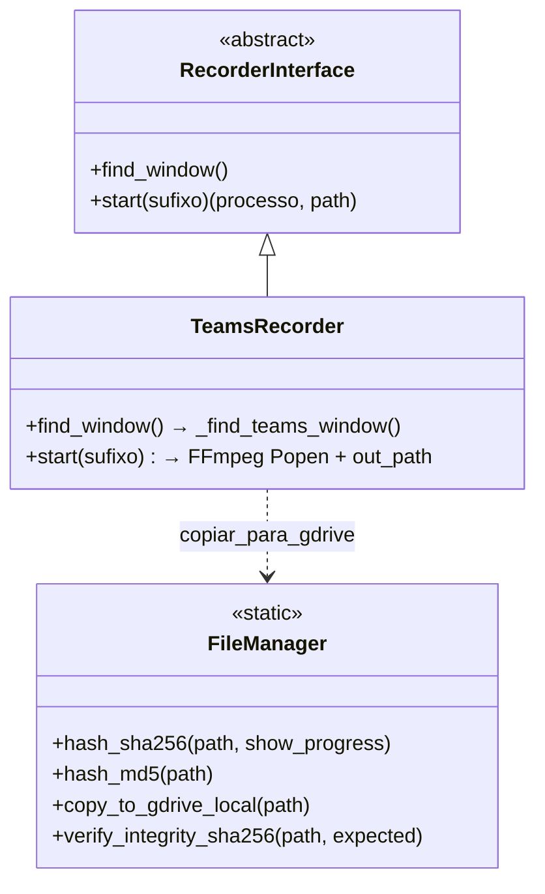
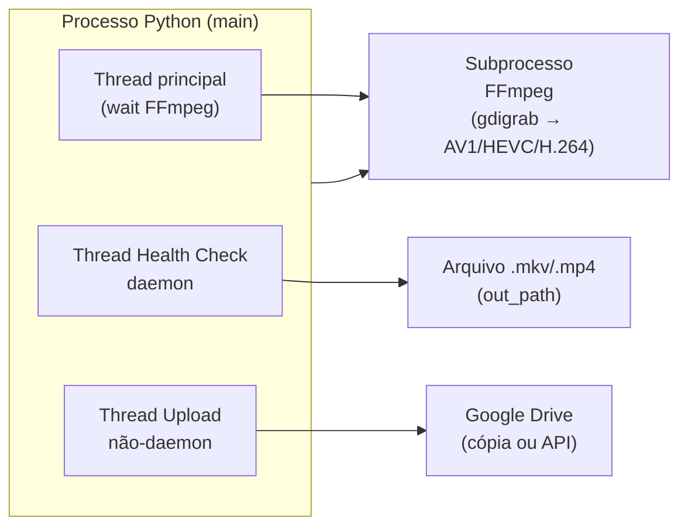

# 🏗️ Arquitetura do sistema

Este documento descreve a arquitetura do **Gravador de Aula — Teams FIAP** em detalhe: módulos, responsabilidades, dependências e diagramas (Mermaid) para visualização no GitHub.

---

## 1. Visão geral em camadas

```
┌──────────────────────────────────────────────────────────────────────────┐
│  CAMADA DE ENTRADA (main.py)                                              │
│  Orquestração, signals, health check, upload em background                 │
└──────────────────────────────────────────────────────────────────────────┘
                                    │
                                    ▼
┌──────────────────────────────────────────────────────────────────────────┐
│  CAMADA DE NEGÓCIO                                                        │
│  gravador.py (RecorderInterface → TeamsRecorder)  │  upload_gdrive.py    │
│  file_manager.py (hash, cópia, integridade)                               │
└──────────────────────────────────────────────────────────────────────────┘
                                    │
                                    ▼
┌──────────────────────────────────────────────────────────────────────────┐
│  INFRAESTRUTURA                                                           │
│  config.py (env)  │  logger_config.py (Loguru + Rich)  │  FFmpeg (subprocess)  │  pygetwindow  │  Google Drive API
└──────────────────────────────────────────────────────────────────────────┘
```

---

## 2. Diagrama de contexto (Host → Processo → GRC → Nuvem)

Visão voltada para **GitHub** e **GRC**: separação em Host Windows, processo Python, controles de segurança e nuvem. O GitHub renderiza o Mermaid abaixo nativamente.



---

## 3. Diagrama de componentes (Mermaid)

O diagrama abaixo mostra os módulos e suas dependências. Renderize no GitHub ou em [Mermaid Live](https://mermaid.live/).



---

## 4. Diagrama de sequência — Gravação e encerramento

Fluxo desde o início da gravação até o encerramento (Ctrl+C) e upload em background.



---

## 5. Diagrama de classes (gravador)

Interface e implementação do gravador (padrão Strategy/Interface).



---

## 6. Diagrama de deployment (contexto de execução)

Onde cada parte roda: processo Python, subprocesso FFmpeg, threads.



---

## 7. Mapa de arquivos do projeto

| Caminho | Responsabilidade |
|---------|------------------|
| `main.py` | Ponto de entrada; setup logging; busca janela; inicia gravação; health check (thread); trata Ctrl+C/SIGTERM; dispara upload em thread. |
| `gravador.py` | `RecorderInterface`, `TeamsRecorder`; `_find_teams_window`, `_detect_teams_mode`, `_build_ffmpeg_cmd`, `_janela_em_foco`; `parar_gravacao`; `gravar()`, `copiar_para_gdrive()`. |
| `file_manager.py` | `FileManager`: hash SHA-256/MD5, cópia para pasta Drive local, verificação de integridade. |
| `upload_gdrive.py` | Autenticação OAuth; upload para Drive API; verificação de integridade pós-upload; credential scrubbing. |
| `config.py` | Leitura de `.env`; constantes (GRAVACOES_DIR, CODEC, CRF, FPS, health check, screen-share, etc.). |
| `logger_config.py` | Configuração Loguru: handler Rich (terminal), handler arquivo (auditoria em `logs/`). |
| `tests/` | Testes pytest (config, file_manager, gravador, logger_config, main, upload_gdrive). |
| `.github/workflows/tests.yml` | CI: pytest (Python 3.10–3.12), Ruff, cobertura mínima. |

---

## 8. Dependências externas

| Dependência | Uso |
|-------------|-----|
| **FFmpeg** | Captura (gdigrab), encoding (libsvtav1, libx265, libx264, hevc_nvenc), áudio (libopus). Obrigatório no PATH. |
| **pygetwindow** | Listar janelas e obter título/HWND para localizar a janela do Teams. |
| **python-dotenv** | Carregar `.env` em `config.py`. |
| **Loguru** | Logs estruturados. |
| **Rich** | Console colorido e handler de log no terminal. |
| **Google API (opcional)** | Upload para Drive (OAuth2 + Drive API). |

---

[⬆️ Voltar ao índice](README.md)
