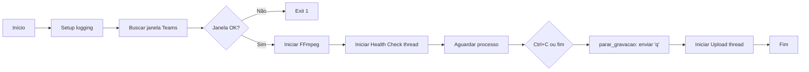
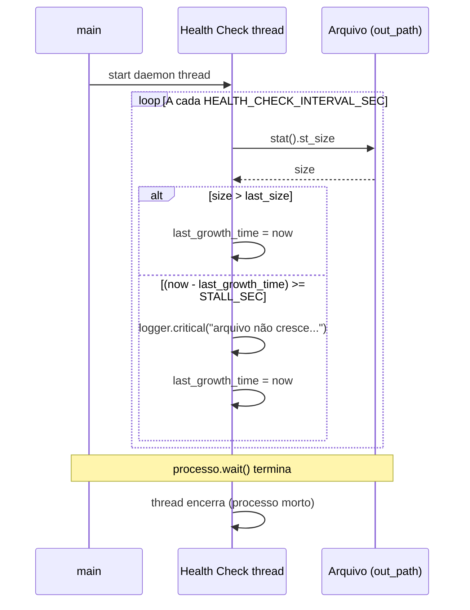

# 🔀 Fluxos

Descrição dos fluxos principais do **Gravador de Aula**: início da gravação, health check, encerramento gracioso e upload em background.

---

## 1. Fluxo geral (alto nível)

---

## 2. Fluxo de gravação (detalhe)

1. **main.py** chama `TeamsRecorder().find_window()` (usa `pygetwindow.getAllWindows()` e filtra por `TEAMS_WINDOW_TITLE`).
2. Se não houver janela → log de erro e `sys.exit(1)`.
3. **main.py** chama `recorder.start()`:
   - Verifica se `ffmpeg` está no PATH.
   - Obtém a janela novamente; se não houver → retorna `(None, None)`.
   - **Leak prevention:** verifica se a janela está em foco (`_janela_em_foco`); se não, log de aviso.
   - **Modo:** `_detect_teams_mode(win.title)` → `"screen_share"` ou `"video"`.
   - Monta o comando FFmpeg com `_build_ffmpeg_cmd(..., mode)` (inclui CRF ajustado no modo screen_share).
   - Cria o diretório de gravação e o nome do arquivo (`aula_YYYY-MM-DD_HH-MM.mkv` ou `.mp4`).
   - Inicia o processo com `subprocess.Popen(cmd, stdin=PIPE, ...)` e retorna `(processo, out_path)`.
4. **main.py** inicia a thread de **health check** (`_monitor_health`) e chama `processo.wait()`.

---

## 3. Health check (monitor de crescimento)

- **Objetivo:** Detectar se o arquivo de saída parou de crescer (ex.: codec travado, disco cheio).
- **Thread:** Daemon; roda enquanto o processo FFmpeg estiver ativo.
- **Lógica:**
  - A cada `HEALTH_CHECK_INTERVAL_SEC` segundos, lê o tamanho do arquivo em `out_path`.
  - Se o tamanho **aumentou** em relação à última leitura → atualiza “última vez que cresceu”.
  - Se o tamanho **não aumentou** e já se passaram **`HEALTH_CHECK_STALL_SECONDS`** desde a última vez que cresceu → emite **alerta crítico** no log (e reinicia o timer de “última vez que cresceu” para não repetir o alerta a cada ciclo).
- **Importante:** O processo **não é morto** automaticamente; apenas o alerta. O usuário pode encerrar com Ctrl+C.

---

## 4. Encerramento gracioso (Ctrl+C ou SIGTERM)

### 4.1 Ctrl+C (SIGINT)

1. **main.py** recebe `KeyboardInterrupt`.
2. Chama `parar_gravacao(processo)`:
   - Se o processo ainda estiver rodando, envia `b'q'` ao **stdin** do FFmpeg.
   - Chama `processo.communicate(input=b'q', timeout=5)`.
   - Se o FFmpeg não terminar em 5 s → `TimeoutExpired` → `processo.kill()` e `processo.wait(timeout=2)`.
3. Assim o FFmpeg **fecha o container** (header do .mkv/.mp4) corretamente, evitando arquivo corrompido.

### 4.2 SIGTERM

- O handler registrado em **main** chama `parar_gravacao(_processo_atual)` e, se houver `_out_path_atual` e config de Drive, inicia a thread de **upload em background** antes de `sys.exit(0)`.

---

## 5. Upload em background

- No **finally** de **main** (e no handler de SIGTERM), se existir `out_path` e (`GDRIVE_PASTA_LOCAL` ou `GDRIVE_PASTA_ID`):
  - É iniciada uma **thread não-daemon** que executa `_upload_em_background(out_path)`.
  - `_upload_em_background` faz, em sequência:
    1. Cópia para `GDRIVE_PASTA_LOCAL` (se definido), via `gravador.copiar_para_gdrive(out_path)`.
    2. Upload via API para `GDRIVE_PASTA_ID` (se definido), via `upload_para_drive_api(out_path)`.
  - O **terminal** pode ser fechado ou reutilizado logo após a mensagem “Gravação encerrada. Cópia/upload em background.”; a thread continua até terminar e loga “Upload/cópia em background concluídos.”.

---

## 6. Diagrama de sequência — Health check

---

[⬆️ Voltar ao índice](README.md)
